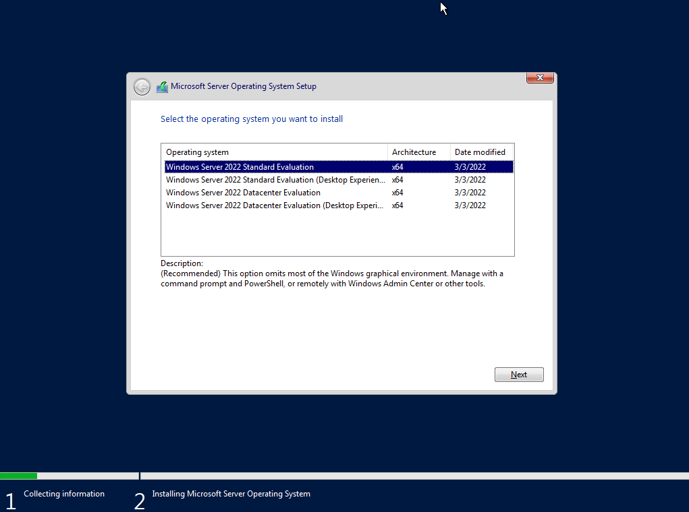
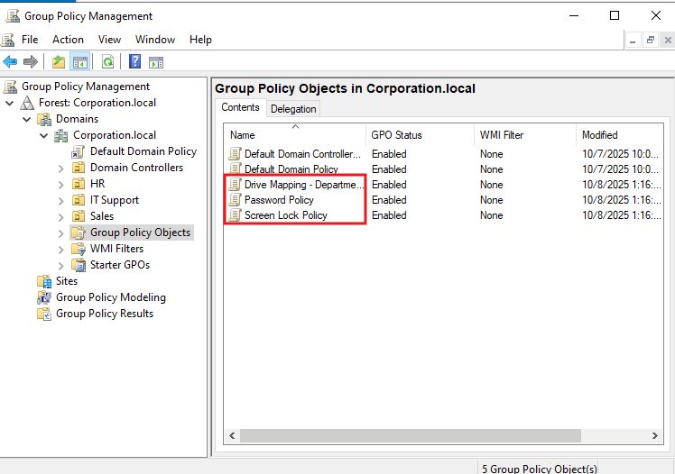

# 🖥️ Active Directory: A look into Active Directory Enviroments, Group Policy Objects, and System Administration

## 📘 Overview

This project demonstrates my ability to deploy and manage a Windows Server Active Directory environment, configure user accounts and group policies, and get an understansing of how Active Directory, Group Policy, and File Sharing within Domains operates. The goal was to simulate real-world IT Support and System Administration tasks focused on user management, security, and system efficiency.

---

## ⚙️ Objectives

- Build a functional **Active Directory domain** in a virtualized environment.
- Create and manage **users, groups, and organizational units (OUs)**.
- Configure and apply **Group Policy Objects (GPOs)** for security and compliance.
- Document the process to mirror **real-world IT administrative practices**.

---

## 🧰 Tools & Technologies

- **Windows Server ISO**

- **Windows 10/11 ISO (for clients)**

- **Virtualization software: VirtualBox, VMware, Hyper-V, or Azure VMs**

- **(Optional) Azure AD Connect**

---

## 🏗️ Setup Steps

### 1. Environment Configuration
When creating this Active Directory setup, I had to figure out a cost-effective way to utilize the Windows Server and Workstation file that I was getting ready to create. After looking through multiple resources, **VirtualBox** seemed to be the best alternative to be able to bring this project together. I then began the process of creating the Virtual Machine.

Keeping allocations and naming simple, I prepared the VM with _**Windows Server 2022 (64-bit)**_ and 50GB of allocation size, to make sure that the server had ample space to function correctly.

After, I confirmed the Windows 2022 Server was configured correctly to the created VM through my storage settings.

Finally, I was able to confirm that my VM was working and reading the .iso correctly.

Specifically for setting up this homelab, I focused on using the _**Windows Server 2022 Standard Evaluation (Desktop Experience)**_ because this instance is being used as a homelab / testing enviroment. There is the option to use the _**Windows Server 2022 Datacenter Evaluation (Desktop Experience)**_ for more features and accessibility, but it was not needed for this project.

After installing the Microsoft Server Operating System, I continued to create an Administrator account, and proceeded to get to the login screen successfully. Once logged in, I could confirm that the Server Manager was present and available.

After the Server Manager was confirmed, I began to get started with creating an Active Directory Domain Controller. By starting with renaming the instance PC, I would then save the changes to restart and continue to create the controller.

Post-restart, I proceeded to add Roles and Features...

...and selected _**Role-based or feature based installation**_ > Select the renamed Server VM (WindowsVM in this circumstance) > Select Active Directory Domain Services > Click "Next" on Features > Click "Next" on AD DS > Enable _**Restart the Destination Server Automatically If Required**_ > Proceed to install.

Once the install is finished, the server must be promoted to a domain controller:

After clicking, I selected _**Add A New Forest**_ and created a passowrd for the forest as well.

After this, I continued to the Additional Options of the configuration, and verified that the NetBIOS name was automatically created (by default the name should be populated, but can be changed).

Once finished, I proceeded to the **_Prerequisites Check_** to confirm that the checks were passed successfully. The check confirmed that everything was correct, and I proceeded with the installation.

The server had to be restarted, and once done, I could successfully login to the server again.

### 2. User & Group Management

From here, the Active Directory Domain Controller has been successfully created; I then wanted to create users that could be managed through network computers. This step primarily confirms that users are able to log into the ADDC, and can be created through the _**Active Directory Users and Computers Tool**_ for creating groups, users, etc.

Through the tool, I was able to create a new user by right-clicking _**Users**_ > New > User.

As a test, I created an IT Support user login to test the newly created user, set up a password for the account, verified the information, and continued.

Once this was confirmed, I deleted the previous user, then created different _**Organizational Units**_ to specify users and what groups they belonged to. In this circumstance, I made an IT, Sales, and HR group. In those groups, I made users to replicate a distribution of users.

Each Group had a user that was dedicated to a task (IT, Sales, HR) and would proceed to be the test units for the rest of this project. Proceeding with this, I decided to make _**Security Groups**_ for these Organizational Units. This option is necessary in order to change Read/Write/Modify options, and can be configured to groups that may need / not need the access to certain permissions. IT Support will have _**Full Control**_, HR will have _**Modify(or Change)**_, and Sales will have _**Read Only**_ permissions.
To start, these Groups can be created by **Right-clicking the Organizational Unit > New > Group**.

The Group Scope is set to **Global**, and the Group Type is set to **Security**. The scope and type can vary depending on the type of group that needs to be made. Once the group is made, the users can be added towards the group by selecting **Members > Add.**

The username of the account needed must be added to the "Object Names to Select" box; once entered, click **Check Names** to auto-populate the box with the user account, and click **OK**, then **Apply**.

The Security Groups have been successfuly created. I then decided to create _**Group Permissions**_ for given reseources. This can be done in a couple different ways, but for this project, I decided to create it through the GUI. To begin, I navigated to the **C Drive Main Directory**, and created starting folders for each of the groups that were created. I made a main folder titled **Deparment Shares**, and within that folder, created three seperate folders: **HR, IT, and Sales**.

Each folder needed to be configured to have permissions towards acess: I did so by **Right-clicking the folder > Properties > Sharing > Advanced Sharing.** I enabled **"Share this folder"** and named it correspondingly: **ITShare for IT, HRShare for HR, and SalesShare for Sales.**

Once done, select **Permissions** and remove the **"Everyone"** group. This will be replaced for the corresponding group that needs access, and once replaced, will look as such: 

In this circumstance, HR will have **Change and Read** controls. This will be repeated for the other two folders as well, and correspond to what permissions are needed with files in them. After that is done, I made sure to change the permissions within the **Security** tab.

**HR-Team** had to be added towards the Groups, and then given the same permissions for the files. After confirming, I did the same for the remaining two groups, **IT and Sales.** After confirming the permissions, I then proceeded to move onto **Group Policy and Implementation.**

### 3. Group Policy Implementation
For Group Policy, I know that the system needed some form of administration over computer settings (i.e. screen locking, password restrictions, etc.) to be used across the existing domain for the example corporation. Creating the group policy is similar to how one could use tools to create users and the like from the Domain Controller, but in a different tab. I was able to access it from the Server Manager by going to _**Tools > Group Policy Management**_.

Once there, I navigated to the **Corporation.local** tab, fully expanded the tab and navigated to Group Policy Objects. Once there, I had to create a new policy, with three of them being focused on different aspects:

- Password Policy
- Screen Lock Policy
- Drive Mapping - Department Shares

Editing these policies are navigated by **Right-Clicking the created policy > Edit > Navigate toward the specific location that your policy is based in**: 

- Password Policy: _**Computer Configuration → Policies → Windows Settings → Security Settings → Account Policies → Password Policy**_
- Screen Lock Policy: _**User Configuration → Policies → Administrative Templates → Control Panel → Personalization**_
- Drive Mapping: _**User Configuration → Preferences → Windows Settings → Drive Maps**_

For **Password Policy**, I went for specific secure standards, changing some of the policies to standard-known, and others to own preference:

- Minimum password length: 10
- Password must meet complexity requirements: Enabled
- Maximum password age: 60 days **(changes the Minimum Password Age default to 30 days)**
- Enforce password history: 5

For **Screen Lock Policy**, I changed the active timeout for a screensaver to **600 seconds**, and to **lock the screen with password** when the timeout occurs.

It is important to note that _**the Group Policy Object has to be linked towards the Organizational Unit**_ in order to take effect. This can be done by dragging the policy directly to the Oganizational Unit that is requested. You will then be met with a confirmation- select **Yes** to confirm it.  

Finally, I wanted to create one more policy for **C Drive Mapping** for the shared folders. I navigated towards the location for the policy for Drive Mapping, and then proceeded to create a new mapping that would coordinate with the given Organizational Units: _**I: for IT, H: for HR, S: for Sales**_.

There are a couple of things that I had to configure to make sure the drive was connected:
- **Location** would be set as the location of the shared folder for the drive that you want to re-organize, in this case, it was the **_ITShare_** folder.
- **Reconnect** had to be enabled
- The **Drive Letter** had to be assigned as I had planned out before
- I had to make sure that the users in the enabled group got the correct drive, by navigating to **Common > Enabling Item-level targeting > Selecting "Targeting..." > adding the Security Group for the specific drive (in this case, IT-Support).**

This same scenario must be done for each of the drives, and when finished, will look like so:

Aftet this was all done, I confirmed that each one of the Organizational Units had the policies instilled on each other:

So as seen, each one of the OU's contains:
- A **Screen Lock Policy** to confirm that the screen times out after a specified amount of time, and locks
- A **Drive Mapping Policy** to navigate drives towards specified groups.
- A **Password Policy** by default for all users, for security reasons.

And with that, the project comes to a close (for now).

---

## 📊 Results & Impact

Throughout the project, I developed a fully functional Active Directory domain (corporation.local) which mimicked a live enterprise environment. I established distinct Organizational Units for departments (IT, HR, Sales), configured security groups, as well as utilized role-based access control to manage permissions to utilize shared network resources. I created and secured department-specific shared folders and mapped drives while enforcing the same password and lockout policies using Group Policy Objects (GPOs). Overall, this experience enhanced my understanding of working within a corporate IT infrastructure by administering systems, provisioning accounts, and managing access.

## 💡 Key Learnings

From this project, I had the opportunity to engage with Active Directory (AD) on a practical level such as user provisioning, OU navigation, role-based permissions, and general management. I also learned how to leverage Group Policy Objects (GPOs) to create consistent configurations and security configurations across the domain. In regards to secure data access, I enhanced my understanding working with network file sharing and NTFS permissions. I used the GUI  interface to develop technical agility, but would also like to learn PowerShell scripting to benefit that as well. Overall, I improved documenting and communicating complex processes clearly and effectively through the system.

## 🧠 Future Enhancements

In the future, I aim to build on this project by onboarding Microsoft 365 leveraging Azure AD Connect to sync on-prem users and enable hybrid identity with single sign-on. I will also implement Microsoft Intune for endpoint management to enforce compliance, automate software delivery, and greatly enhance remote management. I will also introduce PowerShell scripts to automate user onboarding, permission assignment, and reporting, improving efficiency and scalability.

---
